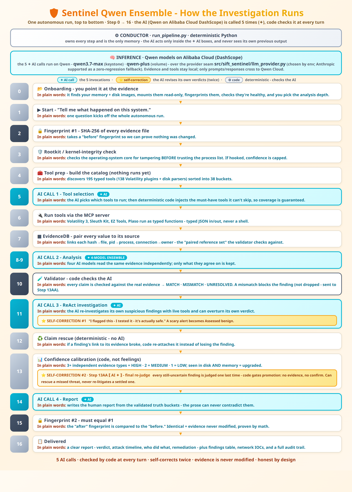

# ARCHITECTURE.md

**Sentinel Ensemble** - System Architecture
Autonomous DFIR/SOC triage agent on Qwen Cloud (Alibaba DashScope) - Track 4
Autopilot Agent. Deterministic trust layer: **code, not the model, decides
what is confirmed.**
Global AI Hackathon with Qwen Cloud, Track 4 (Autopilot Agent) | Adil Eskintan
*(internal Python package: `sift_sentinel`)*



---

## Design Philosophy

Sentinel Ensemble treats the AI - **Qwen models hosted on Alibaba Cloud
(DashScope) by default; Anthropic supported via the same provider seam** - as a
brilliant but **untrusted soloist**. Deterministic Python (the conductor)
controls the entire pipeline. The model reasons only when summoned, and every
claim it makes is verified against tool output before reaching the report.

It is a custom **agentic architecture**: a deterministic conductor drives a
16-step pipeline and invokes the model **5 times** - the 4 numbered invocations
(tool-selection, analysis, ReAct, report) plus the Step-13AA self-correction
finalize - not an off-the-shelf agent CLI.

> ### Architectural pattern - **Custom MCP Server**
> Of the hackathon's four patterns (Direct Agent Extension · **Custom MCP
> Server** · Multi-Agent Framework · Alternative Agentic IDE), Sentinel Ensemble
> is a **Custom MCP Server**: every one of the 195 forensic tools is a typed
> function on our own Model-Context-Protocol server, and the agent has **zero
> shell access**. Guardrails are classified as **architectural** (a guarantee
> the model *cannot* bypass - e.g. no shell exists to call) vs **prompt-based**
> (the honest weakest layer) - see [Guardrail classification](#guardrail-classification-required-disclosure---what-kind-of-guarantee-each-layer-gives).

**Key differentiator**: Zero shell access. The AI never constructs or
executes command-line syntax. All forensic tools are exposed as typed
Python functions via the Model Context Protocol (MCP). The AI receives
pre-parsed, validated JSON - never raw stdout.

---

## Entry Point

```
./setup.sh run /path/to/case        ◀── what the user types (ONE line)
  Docker: builds the image once, forwards the key + SIFT_* env,
  FUSE caps for .E01, mounts the evidence read-only
        │
        ▼  container entrypoint
findevil.sh  ──▶  findevil.py  ──▶  step0_onboard.py  ──▶  run_pipeline.py (the conductor)
 dependency-checks    ONE question: where    drives all 16 steps below
 + friendly errors    is the evidence? +
                      read-only profiling
```

---

## The Pipeline - Step 0 to Step 16

```
        ╔═══════════════════════════════════════════════════════════════════╗
        ║   CONDUCTOR · run_pipeline.py · deterministic Python              ║
        ║   owns every step - the AI acts only inside the  AI ✦  brackets ║
        ╚═══════════════════════════════════════════════════════════════════╝

 Step  0 ─▶ ONBOARDING (findevil.sh, the entrypoint behind ./setup.sh run) - human presses start
            │      case discovery + per-case health cards · E01 disk mount (ro)
            │      OS/profile probe (vol3 windows.info · fsstat - must agree)
            │      SHA256 precompute · depth select: ⚡HEAVY / 🪶LIGHT
            │      hidden API-key live verification · BASH_HISTORY_CLEARED_GATE
            │
 Step  1 ─▶ Pipeline start - "Tell me what happened on this system."
            │
 Step  2 ─▶ 🔒 SHA256 fingerprint №1  ✦  warm-start
            │      reuses onboarding-precomputed, size-verified hashes
            │      (SHA256_WARM_START_GATE - no cold re-hash)
            │
 Step  3 ─▶ SSDT rootkit check + 3b memory-profile health
            │      kernel integrity BEFORE trusting processes
            │      (no kernel-clean claim inferred - trust level only)
            │
 Step  4 ─▶ TOOL-SELECTION PREP - typed catalog built, NO tools run yet
            │      186 forensic tools dynamically discovered (138 Vol3 plugins)
            │      38 semantic buckets · 0 fake advertised tools
            │      gates: 31X-lite surface · dynamic-only · token budget
            │
 Step  5 ─▶  AI ✦ INVOCATION 1 - TOOL SELECTION 
            │      195-tool MCP catalog ──⇄── AI picks an investigation set
            │      slot-31K selection guardrails (deterministic, post-selection): inject
            │      artifact-gated high-value tools, drop lower-value,
            │      YARA opt-in only · fallback: Golden Path defaults
            │
 Step  6 ─▶ MCP SERVER ⇄⇄ forensic tools (typed JSON in/out - never a shell)
            │      Volatility 3 · Sleuth Kit · EZ Tools · Plaso ...
            │      core-aware parallel workers · derived-after-raw ordering
            │      (extract_network_iocs · decode_base64 wait for raw sources)
            │
 Step  7 ─▶ EvidenceDB - typed-fact sidecar + PAIRED reference set
            │      typed facts reconciled across families, with provenance
            │      {hash⇢file} {pid⇢process} {conn⇢owner} {path⇢artifact}
            │      candidate observations ranked → validation-ready set
            │
 Steps 8-9 ▶  AI ✦ INVOCATION 2 - ANALYSIS (4-model ensemble) 
            │      parsed facts in ──⇄── candidate findings out (prompt-cached)
            │      entity-keyed merge · 2+/3+ cross-model consensus tracked
            │      Pydantic schema enforced · semantic emission gate
            │
 Step 10 ─▶ 🧪 DETERMINISTIC VALIDATOR - code checks AI
            │      runs CONCURRENT with Step 11 (wall time = max, not sum)
            │      every claim vs paired reference set - all 6 claim types
            │      (hash · pid · timestamp · connection · child-process ·
            │       process-exists) → MATCH ▸ MISMATCH ▸ UNRESOLVED
            │      blocked ≠ dropped - routed to Step 13AA final cross-check
            │
 Step 11 ─▶  AI ✦ INVOCATION 3 - INVESTIGATION THREADS (ReAct) 
            │   ╔═ ⭐ SELF-CORRECTION · LAYER 1 ═══════════════════════════╗
            │   ║  the AI re-investigates ITS OWN findings with live tool  ║
            │   ║  calls and OVERTURNS its own verdicts (FP/benign flips)  ║
            │   ╚══════════════════════════════════════════════════════════╝
            │      parallel threads · reason ▸ act ▸ observe · live MCP calls
            │      cached-result redirects (vadinfo→ldrmodules, no slow rescans)
            │      FP verdicts force severity LOW at Step 13
            │
 Step 12 ─▶ ♻️  SELF-CORRECTION ROUTING
            │      R1b deterministic claim rescue (re-bind to existing indexes)
            │      inv3a enabled → generative SC skipped; blocked findings
            │      deferred to Step 13AA · honest failure: unrescued findings
            │      go to review - never silently suppressed
            │
 Step 13 ─▶ CONFIDENCE CALIBRATION (deterministic Python)
            │      3+ independent artifact types = HIGH · 1-2 = MEDIUM · 0 = SPECULATIVE
            │      XCORR cross-artifact corroboration · cross-domain
            │      (disk AND memory) upgrade · 31AM user attribution (SID→user)
            │      ├─ 13A  ENTITY RECONCILIATION (downgrade-only)
            │      │       JIT-RWX gate · FP-routing · WHO attribution
            │      ├─ 13AA  AI ✦ FINALIZE (inv3a) 
            │      │   ╔═ ⭐ SELF-CORRECTION · LAYER 2 ════════════════════╗
            │      │   ║  the agent's FINAL re-judge of every NON-TERMINAL ║
            │      │   ║  finding - its own uncertain & blocked output     ║
            │      │   ╚═══════════════════════════════════════════════════╝
            │      │       scope: needs-review · inconclusive · synthesis ·
            │      │       validator-blocked · floor-buried benign
            │      │       (any severity, LOW/INFO included)
            │      │       → confirmed / needs-review / false-positive
            │      │       promotion denials enforced: no evidence, no promotion
            │      │       proven confirmed + adjudicated benign stay terminal
            │      ├─ 13B  FINAL DISPOSITION ROUTING → truth buckets
            │      │       confirmed · needs-review · benign/FP · inconclusive
            │      └─ 13C  REPORT TRUTH VALIDATION (bucket-consistency gates)
            │
 Step 14 ─▶  AI ✦ INVOCATION 4 - REPORT 
            │      validated truth buckets in ──⇄── investigative narrative out
            │      WHO/WHEN per finding · per-user activity section ·
            │      citations required · prose may never contradict the buckets
            │
 Step 15 ─▶ 🔒 SHA256 fingerprint №2 - must equal №1 (spoliation check)
            │
 Step 16 ─▶ 📋 Delivered: narrative · findings table · AI-detected FP table ·
            network-IOC roll-up · audit trail · run summary + cost telemetry
```

> [!IMPORTANT]
> ### 🏆 Where the self-correction credit is earned (judging: Autonomous Execution Quality)
>
> | | What happens | Step | In plain words | Where you SEE it |
> |---|---|---|---|---|
> | ⭐ | **The AI double-checks its own work** | 11 | It takes its own suspicious findings back to the evidence with real tools - and **changes its mind when it was wrong**: "I flagged this. I tested it. It's actually safe." | the report row that says `Assessed benign: …` |
> | ⭐ | **One last review before the report** | 13AA | Every finding that isn't already *proven* or *cleared* gets judged **one more time** - including the ones that failed earlier checks. Nothing gets thrown away quietly. | the console line `INV3A_FINALIZE moved=39/46` |
> | 🛡️ | **A safety net underneath** (plain code, not AI) | 12 | If a finding's link to its evidence breaks, the system re-attaches it instead of losing the finding. | the console line `INV3A_REVIEW_BLOCKED routed=N` |
>
> **Two shapes of correction (what turns into what):**
>
> - ⭐ **A false alarm cleared - Step 11 (ReAct).** A process *listening on a
>   port* is flagged 🔴 *Command & Control*; the AI checks what the process
>   actually is, finds a legitimate forensic agent, and clears it
>   🟢 *"Assessed benign: …"*.
>   **A scary "C2 backdoor" becomes "it's just the responder's own tool."**
> - ⭐ **A missed threat rescued - Step 13AA (finalize).** A service-persistence
>   finding fails the first validation pass and is parked ⚪ *inconclusive*; the
>   final review re-judges it against the full evidence and promotes it
>   🔴 *Confirmed malicious.*
>   **An "unproven, set aside" finding becomes a confirmed attack.**
>
> **The full autonomous arc - visible end-to-end in `agent_execution_log.txt`:**
>
> 1. **Hypothesis →** the agent forms one and picks a tool to test it: *"I need
>    vol_cmdline on PID 8260 to confirm execution from the temp perfmon staging
>    path"* (the model's own logged reasoning).
> 2. **Test →** it fires the chosen tool (`vol_cmdline` on PID 8260), then pulls
>    `get_amcache` on the same chain to corroborate SHA1 / first-run.
> 3. **Recognize the mismatch →** the 4-model ensemble disagrees and the
>    deterministic validator **blocks 22 unsupported claims** - the agent never
>    accepts its own assertion as proof.
> 4. **Re-sequence →** Step 11 ReAct re-investigates the flagged findings with
>    fresh tool calls (F001/F002/F004/F005/F006/F007…), clearing a false-positive
>    C2 listener to benign.
> 5. **Withhold honestly →** Step 13AA re-judges, and *code* refuses to promote
>    **25 of the 27** findings the model *recommended promoting* to confirmed.
>
> Every step is a timestamped line in the execution log - the arc **is** the
> evidence, not the narration.
>
> One clears a false positive, the other rescues a true one - same system,
> both directions.
>
> **What Step 13AA re-judges (by disposition, NOT by severity):** *everything
> that isn't already proven-confirmed or already-cleared-benign* - the entire
> needs-review bucket (**HIGH and MEDIUM included**), inconclusive, synthesis,
> and validator-blocked/rejected findings, at every severity. It only leaves
> the two terminal tiers - proven confirmed and adjudicated benign - untouched,
> so the pass can recover a missed threat but never re-litigate a settled one. The two ⭐ rows are the self-correction the judges ask to
> see; either alone satisfies the demo-video requirement, and showing both
> (plus the 🛡️ net) proves the agent corrects itself while *thinking*, again
> while *deciding*, and never loses work in between.
>
> 📄 **Full receipt:** every self-correction from the reference run - both layers,
> before → after, each with its `agent_execution_log.txt` line - is enumerated in
> **[`SELF-CORRECTION-PROOF.md`](SELF-CORRECTION-PROOF.md)**.

---

## MCP Server Pattern

### 195 Typed Tools, Zero Shell Access

The MCP server (`src/server.py`) advertises **195 typed tools** - **186
dynamically discovered** forensic tools plus **9 core/meta** functions.
Seven golden-path core tools anchor the fallback selection. Every tool:

- Accepts typed parameters (Pydantic-validated)
- Returns a standard JSON envelope: `{tool_name, execution_time_ms, evidence_path, record_count, output}`
- Runs forensic CLIs internally (Volatility 3, Sleuth Kit, EZ Tools, YARA, Plaso)
- Never exposes raw command syntax to the AI

### Tool Surface

| Family | What it covers |
|---|---|
| Golden-path core (7) | `vol_pstree`, `vol_netscan`, `vol_malfind`, `vol_cmdline`, `vol_dlllist`, `get_amcache`, `extract_mft_timeline` |
| Memory (Volatility 3) | process/network/injection/kernel surfaces: psscan, handles, svcscan, ssdt, modscan, ldrmodules, psxview, ... |
| Disk & artifacts | event logs, prefetch, shellbags, registry, USB/removable media, SRUM, WMI persistence, PowerShell transcripts, RDP artifacts, ... |
| Carving & sweeps | YARA, bulk_extractor, strings/exif/ssdeep, timeline (Plaso) |
| Discovery/meta (9) | category browsing + tool recommendation + run status |

*(The exact registry is enumerated at runtime - 186 discovered + 9 core/meta
at the time of writing; counts grow as tools are added, the architecture does
not change.)*

### Why MCP Over Bash

| Approach | Risk | Sentinel Ensemble |
|---|---|---|
| Raw bash execution | Prompt injection, command injection, evidence modification | Not possible - no shell access |
| Catalog-gated bash | AI selects from allowed commands, still runs via shell | Not used - architectural constraint |
| Typed MCP functions | AI calls Python functions with typed params, gets parsed JSON | **This is what we do** |

---

## 14 Defense Layers

> Terminology: there are **14 architectural defense layers** (below); of these,
> **~13 are fail-closed promotion gates** (the phrase used elsewhere in the docs).
> Different framings of the same trust architecture, not different counts.

### Guardrail classification (required disclosure - what kind of guarantee each layer gives)

We deliberately distinguish three strengths, strongest first, and never
label implemented policy as "architectural":

| Class | Guarantee | Layers |
|---|---|---|
| **ARCHITECTURAL** - the capability does not exist | the model cannot do it even if it tries: no shell function exists, the mount is OS-level read-only | 1 (read-only mount) · 5 (typed MCP, zero shell) |
| **DETERMINISTIC CODE** - Python checks the AI | violations are detected/blocked by code paths that run on every pipeline execution and are unit-tested - incl. the post-selection 31K tool injection the AI cannot drop | 2 · 3 · 4 · 6 · 7 · 9 · 10 · 11 · 12 · 13 · 14 |
| **PROMPT-BASED** - instructions the model could ignore | honest weakest layer: citation requirements, schema instructions, tool-noise suppression inside the 5 invocation prompts. Everything prompt-level is backed by one of the layers above (e.g. citations are re-checked by `validate_report`) | invocation prompts (8 is the hybrid: deterministic rescue + one AI pass whose output is re-gated by code) |

### Layer 1: Read-Only Mount
Evidence directories mounted with `mount -o ro`. OS-level write
protection. The AI has no mechanism to bypass this.

### Layer 2: SHA256 Integrity
SHA256 hash computed before analysis (Step 2) and after analysis (Step 15).
Any mismatch triggers a SPOLIATION alert and pipeline abort.

### Layer 3: SSDT Rootkit Check
Kernel integrity verified via `vol_ssdt` BEFORE trusting process listings.
If SSDT hooks are found, the pipeline sets `ssdt_trust: degraded` and caps
memory-based confidence at MEDIUM.

### Layer 4: Guarded Tool Selection (31K)
The AI proposes an investigation set, but deterministic code has the last
word: artifact-gated high-value tools are **injected after selection** (the
AI cannot drop them), lower-value picks are pruned, heavyweight scans (e.g.
YARA) are opt-in only, and a Golden Path default list replaces the selection
entirely if Invocation 1 fails. Coverage is guaranteed by code, not by the
model's choices.

### Layer 5: Typed MCP Functions
195 typed tools, zero bash. All parameters validated by Pydantic. All
outputs are pre-parsed JSON. No prompt injection vector.

### Layer 6: Paired Reference Set
Reference set maps values to their source artifacts:
- `{sha1: filename}` - not a flat set of hashes
- `{pid: process_name}` - not a flat set of PIDs
- `{connection_key: process_name}` - full tuple linkage

Cross-contamination detection: if a hash exists but maps to a different
filename than claimed, the finding is MISMATCH.

### Layer 7: Deterministic Validator
Code checks AI, not AI checks AI. Six claim checkers (matching the 6 claim
types at Step 10):
- `_check_hash()` - SHA1 exists AND maps to claimed filename
- `_check_pid()` - PID exists AND maps to claimed process
- `_check_timestamp()` - timestamp exists for claimed artifact
- `_check_connection()` - connection tuple exists with correct process
- `_check_child_process()` - claimed parent→child relationship exists
- `_check_process_exists()` - claimed process is present in the process set

ANY claim MISMATCH = finding BLOCKED. No majority vote.

### Layer 8: Claim Rescue + Self-Correction
Blocked findings are first **rescued deterministically** (R1b: claims
re-bound against existing evidence indexes - exact matches only, fact
MISMATCH is never "repaired"), then finalized by the **Step 13AA single-call
FP-sweep** (one AI pass over ambiguous buckets, badge-labeled
`[AI-Self-Corrected→tier]` in the report). The legacy 3-tier generative loop
(TARGETED_FIX → DIFFERENT_EVIDENCE → MINIMAL_CLAIM, clean slate per attempt,
max 3 × 30s) remains as the fallback path. Unrescued findings are reported
**UNRESOLVED - honest failure over a wrong answer.**

### Layer 9: Confidence Calibration
Deterministic Python, not AI judgment:

| Artifact Types | Ceiling |
|---|---|
| 3+ independent types (memory + disk + logs, ...) | HIGH |
| 1-2 types | MEDIUM |
| 0 types | SPECULATIVE |

SSDT degraded + memory-only evidence = capped at MEDIUM.

### Layer 10: Process Ancestry Validator
Hunt Evil PPID checks (deterministic Python):
- svchost.exe parent must be services.exe
- lsass.exe parent must be wininit.exe
- csrss.exe parent must be smss.exe

Wrong parent = suspicious process flagged.

### Layer 11: Strict Validation Mode
When `--strict-validation` is set, findings backed by a single claim
are treated as MISMATCH even if that claim passes. Requires 2+
corroborating claims.

### Layer 12: DKOM Detection
Cross-references psscan (pool tag scan) against pstree (linked list walk).
Processes found by psscan but missing from pstree are flagged as
DKOM_CANDIDATE (Direct Kernel Object Manipulation - process hiding).

### Layer 13: Confirmed-Bucket Corroboration Floor
A finding enters the **confirmed** bucket only with independent
corroboration: a non-weak semantic signal, an external public connection,
multi-tool injection evidence, a conclusive structural detector, or strong
typed-fact support with concrete provenance (real tool + real fact id).
Weak-alone signals (e.g. disk-history-only) are demoted to needs-review -
killing the "weak installer outranks real evil" inversion class.

### Layer 14: Report Integrity
The finished report can never contradict itself:

- **Prose vs. buckets** - if the AI-written summary calls a finding
  "confirmed" that the pipeline did *not* confirm, a deterministic pass at
  the report-write chokepoint appends the finding's true status right next
  to the id (and `validate_report` records the catch in the audit trail).
- **One artifact, one verdict** - duplicate findings about the same file
  hash, fully-qualified path, registry key, event record, or **Windows
  service identity** are merged/reconciled before rendering, so the same
  evidence is never reported as both benign and suspicious.
- **Benign rows explain themselves** - every finding in the benign bucket
  states *why* it was cleared (its bucket membership outranks any missing
  internal markers), never the generic "why this is dangerous" text.
- **Display hygiene** - internal mount paths, raw JSON entity arrays, and
  internal counter ids are stripped from titles/details by shape grammar
  before a human reads them. Pure presentation; never changes a verdict.

---

## Invocation Flow

The conductor invokes the model **5 times** per run (Qwen on Alibaba Cloud
DashScope by default; Anthropic via the same seam) - the 4 numbered invocations
plus the Step-13AA self-correction finalize. Each is **stateless** --
the AI never sees its own previous output; the conductor is the memory.

```
╔══════════════════════════════╗              ┌─────────────────────────────────┐
║  CONDUCTOR (Python)          ║              │   MCP SERVER (typed tools)      │
║  run_pipeline.py             ║              │   Volatility 3 · Sleuth Kit ·   │
║  - the only memory -         ║              │   EZ Tools · YARA · Plaso       │
╚═══════════╤══════════════════╝              └────────────────┬────────────────┘
            │                                                  ┆
            │                                                  ┆  typed JSON only
            │                                                  ┆  - never a shell
            ├─▶ INV 1 ✦ TOOL SELECTION ◀┄┄┄┄┄┄┄┄┄┄┄┄┄┄┄┄┄┄┄┄┄┤
            │      catalog in ▸ tool list out                  ┆
            │      fallback: Golden Path defaults              ┆
            │                                                  ┆
            ├─▶ INV 2 ✦ ANALYSIS  (text-only)                ┆
            │      4-model ensemble · 1 turn                   ┆   no tool
            │      facts in ▸ findings out (Pydantic)          ┆   access here
            │                                                  ┆
            ├─▶ VALIDATOR (deterministic - no AI)              ┆
            │      every claim ⇢ paired reference set          ┆
            │      ⇢ MATCH / MISMATCH / UNRESOLVED             ┆
            │                                                  ┆
            ├─▶ INV 3 ✦ ReAct THREADS ◀┄┄┄┄┄┄┄┄┄┄┄┄┄┄┄┄┄┄┄┄┄┄┘
            │      reason ▸ act ▸ observe - live typed tool calls
            │
            ├─▶ R1b CLAIM RESCUE (deterministic) + 13AA ✦ FINALIZE
            │      re-judges every NON-TERMINAL finding:
            │        needs-review · inconclusive · synthesis (any
            │        severity, LOW/INFO included) · validator-BLOCKED/
            │        rejected (R1b-rescued first) · floor-buried benign
            │        that no adjudicator ever saw
            │      verdicts: confirmed* | needs-review | false-positive |
            │        honest UNRESOLVED - *promotion stays evidence-gated;
            │        proven confirmed + adjudicated benign stay terminal
            │
            └─▶ INV 4 ✦ REPORT  (text-only, 1 turn)
                   narrative · WHO/WHEN · network-IOC roll-up · citations
```

---

## Token Budget Management

`prepare_prompt()` (src/sift_sentinel/tools/common.py) controls how much
raw tool output the AI sees: token-budgeted, priority-sorted tools,
adaptive per-record truncation. Global `_token_totals` dict tracks
input/output tokens across all invocations for cost accounting; the report
banner shows the **real** bill.

---

## Reference Set Construction

`build_reference_set()` (src/sift_sentinel/validation/reference_set.py)
creates paired value mappings from all tool outputs:

```python
{
    "hashes":                {sha1_lower: filename},
    "pid_to_process":        {pid_int: process_name},
    "timestamps_per_artifact": {artifact: [normalized_ts, ...]},
    "connections":           {"pid:local->foreign": process_name},
    "paths":                 {filename_lower: [full_paths]},
}
```

Per-tool extractors normalize field names and timestamps. Timestamp
normalization strips timezone offsets, fractional seconds, and T
separators to produce consistent `YYYY-MM-DD HH:MM:SS` format.

Paired values (not flat sets) enable **cross-contamination detection**:
a hash that exists but maps to a different filename is MISMATCH, not
MATCH.

---

## Validator Chain

`validate_finding()` (src/sift_sentinel/validation/validator.py):

1. Collect all checkable claims from finding
2. Run type-specific checker for each claim (hash, pid, timestamp, connection)
3. If ANY claim is MISMATCH -> finding is **BLOCKED**
4. If strict_validation AND match_count < 2 -> finding is **BLOCKED**
5. If ALL claims MATCH -> finding is **MATCH**
6. If mixed MATCH + UNRESOLVED -> finding is **UNRESOLVED**

No majority vote. No "close enough." Fact disagreement = blocked.

---

## Proven Run Performance

**Shipped result - live Qwen Cloud runs.** The pipeline's two headline runs
executed end-to-end on **Qwen models via the Alibaba Cloud DashScope API** on
the paired Windows reference case (memory + disk), same deterministic trust
layer, two model tiers - plus a **July 1 reproduction** and a **flags-off
ablation**, all four committed in `docs/qwen-runs/`.
Sanitized aggregate metrics are committed in
[`docs/qwen-runs/`](docs/qwen-runs/); full outputs stay uncommitted per the
case-neutral policy.

| Metric | Light (`qwen-plus` ×4) | Heavy (`qwen3.7-max`) |
|---|---|---|
| Total elapsed | 5m 37s | 14m 44s |
| Findings (final) | 11 | 34 |
| **Confirmed malicious** | **0** | **4** |
| needs-review / benign / inconclusive | 9 / 1 / 1 | 21 / 9 / 0 |
| Token usage (in / out) | 614,336 / 23,668 | 306,727 / 89,451 |
| DashScope cache-read reuse | 32,512 | 381,696 |
| Cost (cache-aware, est.) | ~$0.28 | ~$1.53 |
| Evidence integrity (mem + disk) | SHA256 MATCH | SHA256 MATCH |

The light tier confirmed **nothing** (no atomic proof, no confirm - the trust
layer working); the heavy tier reconstructed the intrusion chain and 4 findings
cleared every confirmation gate.

<details><summary>Earlier Claude reference run (architecture-proving, local / not committed)</summary>

Before the Qwen port the same architecture was proven on a Claude reference run
(rd01), kept local per the case-neutral policy - **not** a Qwen result and **not**
shipped: 509 s, 34 tools (30 data-producing / 0 failed), 201,260 typed facts,
ensemble 4 members → 81 raw → 51 merged, 51 candidates / 22 blocked, final 2
confirmed / 42 suspicious / 5 benign / 49 total, ~$15.45 est. (Claude Opus 4.8),
SHA256 MATCH. It only shows the trust layer, the 195 typed tools, and the 16-step
conductor are model-agnostic; the Qwen runs above independently reproduced the
intrusion chain.
</details>

---

*Sentinel Ensemble - Adil Eskintan - Global AI Hackathon with Qwen Cloud, Track 4 (Autopilot Agent)*
