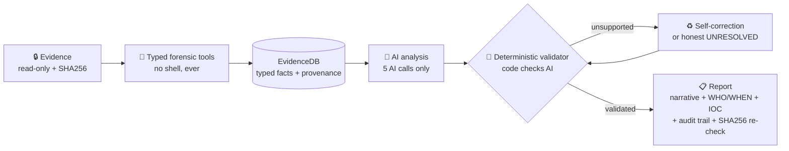

# 🛡️ Sentinel Ensemble


-blue)


**Autonomous agentic DFIR - one Docker command, any OS.** Point it at Windows
evidence (memory image, disk image, event logs) and it investigates end-to-end -
**zero human steering, zero model shell access** - then hands you an
investigative report where **every single claim is validated against real tool
output before you ever see it**.

Incident-response agents fix outages; **Sentinel Ensemble investigates
compromises**: **195 typed forensic tools** on a custom MCP server, **two real
Qwen Cloud runs** on the same intrusion case (**0 vs 4 confirmed** across model
tiers - the trust layer is the constant), and every finding traced to the exact
tool execution that proved it.

> Global AI Hackathon with Qwen Cloud · Track 4 (Autopilot Agent) · Adil Eskintan · MIT License
> *Internal Python package name: `sift_sentinel` (stable import path; the product/repo name is Sentinel Ensemble).*

---

## Submission status (Global AI Hackathon with Qwen Cloud, Track 4)

> Honest status, not a blanket "done" - see [`QWEN-SUBMISSION.md`](QWEN-SUBMISSION.md) for the full writeup.

| Requirement | Status | Location / note |
|---|---|---|
| Open-source license (MIT) | done | [`/LICENSE`](LICENSE) - detected by GitHub, visible in About |
| Public code repository | done | [github.com/3sk1nt4n/Sentinel-Ensemble-Qwen](https://github.com/3sk1nt4n/Sentinel-Ensemble-Qwen) |
| Text description | done | [`QWEN-SUBMISSION.md`](QWEN-SUBMISSION.md) + [What it does](#-what-it-does) |
| Run instructions for judges | done | [Quick Start](#-quick-start) + [`JUDGE-QUICKSTART.md`](JUDGE-QUICKSTART.md) |
| Proof of Deployment - code file + Base URL | done | [`src/sift_sentinel/llm_provider.py`](src/sift_sentinel/llm_provider.py) - live DashScope (Alibaba Cloud) HTTPS calls to `dashscope-intl.aliyuncs.com/compatible-mode/v1`; endpoint also recorded in [`docs/qwen-runs/`](docs/qwen-runs/) |
| Proof of Deployment - Workbench screenshot | add before submit | capture per [`docs/proof/`](docs/proof/) + [`DEPLOY-ALIBABA.md`](DEPLOY-ALIBABA.md); attach to the Devpost "Proof of Deployment" question |
| Architecture diagram | done | [`ARCHITECTURE.md`](ARCHITECTURE.md) + `ARCH_VERTICAL.png` (Qwen/DashScope inference box) |
| Demonstration video (< 3 min) | built - host + link | [`docs/sentinel-qwen-demo.mp4`](docs/sentinel-qwen-demo.mp4) - 2:52, title-card intro + the 0-vs-4 two-tier reveal + real run output from both runs, closing on the spelled-out "Digital Forensics & Incident-Response (DFIR)" card (Built by Adil Eskintan). Upload to **YouTube (Public)** and put the link on the Devpost form (the one open submission step) |
| Track identified | done | Track 4 - Autopilot Agent |
| Trust layer (code, not the model, decides "confirmed") | done | deterministic validator + disposition gates; every finding traces to tool output (`src/sift_sentinel/validation/`, `src/sift_sentinel/analysis/disposition.py`) |
| Self-correction | done | [`SELF-CORRECTION-PROOF.md`](SELF-CORRECTION-PROOF.md) - FP-sweep + ReAct cross-check |

**Proven end-to-end on two real paired (memory + disk) Qwen Cloud runs** on the
same intrusion case - same deterministic trust layer, two model tiers:

| | 🪶 Light (`qwen-plus` ×4) | ⚡ Heavy (`qwen3.7-max`) |
|---|---|---|
| **Confirmed malicious** | **0** - no atomic proof, no confirm (the trust layer working, not a gap) | **4** - PsExec lateral movement · PWDumpX credential dumping · IFEO `sethc.exe` sticky-keys backdoor · `p.exe` from a temp dir |
| Runtime · cost | 5m 37s · ~$0.28 | 14m 44s · ~$1.53 |
| Evidence integrity | SHA-256 MATCH | SHA-256 MATCH |

A July rerun re-confirmed the chain, and a **flags-off ablation** on the same
case measured the trust layer directly: inconclusive jumped **0 → 11** and
confirmations fell **3 → 1** without it. **The bar does not move; the model's
ability to clear it does.** Full comparison + shipped metrics:
[`QWEN-SUBMISSION.md`](QWEN-SUBMISSION.md) · [`docs/qwen-runs/`](docs/qwen-runs/).
The trust layer, the 195 typed tools, and the 16-step conductor are
model-agnostic; only the provider/tier differs.

---

## 🐳 Run it (Docker, any OS)

Works on **Windows, macOS, or Linux** with nothing but **Docker Desktop** - the
image bundles **every forensic tool the agent calls** (Volatility 3, Sleuth Kit,
YARA, EWF, bulk_extractor, EZ Tools, Plaso, RegRipper, pff-tools, photorec).

```bash
git clone https://github.com/3sk1nt4n/Sentinel-Ensemble-Qwen.git && cd Sentinel-Ensemble-Qwen

./setup.sh docker                   # 1) zero-cost demo - no key, no evidence (~30 s)
./setup.sh run /path/to/your/case   # 2) real investigation - ONE line does everything
```

`./setup.sh run` builds the toolchain image on first use (one time, ~15 min),
reads your DashScope key from `.env` / the environment (or asks once, hidden),
applies the verified-run flags, mounts your evidence **read-only**, and launches
the agent. *(Windows: run these inside **WSL2** or **Git Bash**.)* Full guide
(image targets, `.E01`/FUSE, Windows paths, all-Max env):
[`docs/DOCKER.md`](docs/DOCKER.md).

<details>
<summary>What the one line runs under the hood (manual docker commands)</summary>

```bash
# zero-cost demo - no API key, no evidence, no forensic tools (~290 MB)
docker build --target demo -t sentinel-qwen:demo .
docker run --rm -it sentinel-qwen:demo

# toolchain image for real runs:
#   --target full  = memory+disk core (Vol3 + Sleuth Kit + EWF + YARA), ~465 MB
#   (default)      = full-plus: EVERYTHING the agent calls, ~990 MB
docker build -t sentinel-qwen .
# (the --cap-add/--device/--security-opt trio enables .E01 disk mounting via
#  FUSE - all three public cases below ship .E01; harmless for memory-only)
docker run --rm -it \
  --cap-add SYS_ADMIN --device /dev/fuse --security-opt apparmor:unconfined \
  -e SIFT_LLM_PROVIDER=qwen -e DASHSCOPE_API_KEY=sk-... \
  -e SIFT_DEFAULT_MODEL=qwen3.7-max \
  -e SIFT_HTTP_TIMEOUT=600 -e SIFT_ALLOW_YARA=1 \
  -v /path/to/your/case:/evidence:ro \
  sentinel-qwen /evidence
```

</details>

> 🔒 The image never bakes in a key (`.env` is excluded by `.dockerignore`); the
> key is passed at runtime and evidence is mounted read-only (`:ro`).

> 🧪 **Need evidence?** Free, verified public Windows cases (no login) are listed
> in **Get evidence to investigate** below.

---

## 🔑 Get a Qwen Cloud API key (the AI brain)

This project runs on **Qwen models hosted on Alibaba Cloud (DashScope / Model
Studio)**. Provider + model are chosen entirely by environment, so flipping the
whole 16-step pipeline onto Qwen needs **no code change**.

1. Sign up at **https://qwencloud.com** (Alibaba Cloud International) and request
   the hackathon **$40 Qwen Cloud voucher**.
2. Open **Model Studio** (Singapore / International region) → **API Keys** →
   **Create API Key** → copy the `sk-…` string.
   (Direct portal: **home.qwencloud.com/api-keys**.)
3. Give it to Sentinel Ensemble:

```bash
cp .env.qwen.example .env              # then set DASHSCOPE_API_KEY in .env
# or export directly:
export SIFT_LLM_PROVIDER=qwen
export DASHSCOPE_API_KEY=sk-...        # QWEN_API_KEY is also accepted
export SIFT_DEFAULT_MODEL=qwen3.7-max
export SIFT_HTTP_TIMEOUT=600           # heavy-tier calls can run >120 s (see .env.qwen.example)
export SIFT_ALLOW_YARA=1               # match the verified-run tool selection
python3 scripts/qwen_smoke.py          # confirm connectivity before any full run
```

The international (Singapore) DashScope endpoint is the default; set
`DASHSCOPE_BASE_URL` for the mainland-China endpoint.

> **Models & budget.** Keystone analysis runs on a flagship (`qwen3.7-max`); the
> high-call-volume stages run on `qwen-plus` so the **$40** credit lasts (~12-16
> full runs even worst-case). Tiering is in [`.env.qwen.example`](.env.qwen.example).

> **Anthropic fallback (optional).** The provider seam keeps `anthropic` as the
> zero-regression fallback - unset `SIFT_LLM_PROVIDER` and set `ANTHROPIC_API_KEY`
> to run the identical pipeline on Claude. Not needed for the Qwen Cloud submission.

## 🧪 Get evidence to investigate

Any of these work - the pipeline auto-detects what you give it (memory-only,
disk-only, or both together). The public practice cases below are free,
direct downloads - no login (links verified 2026-07-05):

| Source | What you get | Size |
|---|---|---|
| **DFIR Madness "The Stolen Szechuan Sauce"** - [DC01 memory](https://dfirmadness.com/case001/DC01-memory.zip) + [DC01 disk](https://dfirmadness.com/case001/DC01-E01.zip) | **paired memory + disk** (Windows Server 2012 R2 DC) - the strongest shape; unzip both into one folder | 0.6 + 4.8 GB |
| **NIST CFReDS "Data Leakage Case"** - [PC disk image](https://cfreds-archive.nist.gov/data_leakage_case/images/pc/cfreds_2015_data_leakage_pc.E01) | disk-only (Windows 7 `.E01`) - the smallest real case | 2.1 GB |
| **Digital Corpora "Lone Wolf" (2018)** - [image files](https://downloads.digitalcorpora.org/corpora/scenarios/2018-lonewolf/) | paired (Windows 10): split `LoneWolf.E01`-`.E09` + `memdump.mem` | ~14 + 18 GB |
| **Your own captures** | `.E01`/`.raw` disk images, `.raw`/`.vmem`/`.img`/`.mem` memory, exported `.evtx` logs | - |

Put everything for one case in **one folder** (example: `/cases/evidence/`).
A typical strong pair: one memory image + one disk image from the same machine.
(The practice cases are third-party training material by their respective
authors; the pipeline is dataset-agnostic, so any Windows evidence works.)

> 🔒 Evidence is mounted **strictly read-only** and SHA256-fingerprinted before
> and after the run (chain of custody by math, not promises).

## 🚀 Quick Start

```bash
./setup.sh docker                        # zero-cost demo - no key, no evidence
./setup.sh run /path/to/case             # real investigation - one line
./setup.sh run --dry-run /path/to/case   # onboarding + printed plan only, nothing executed
```

A real run, start to finish - one line, two prompts:

1. Run `./setup.sh run /path/to/case` (the folder holding your memory/disk images).
2. It scans the evidence and shows a **case card** (what it found, sizes, SHA256). Just read it.
3. It asks the **analysis depth** - `1` (or Enter) = ⚡ HEAVY (the flagship model;
   `qwen3.7-max` on the Qwen config) or `2` = 🪶 LIGHT (`qwen-plus`, cheaper). The
   model per tier is env-driven (see [`.env.qwen.example`](.env.qwen.example)).
   **Choosing the depth launches the run.**
4. The **API key** step - if you set it already (`.env` or `DASHSCOPE_API_KEY`)
   it's forwarded automatically; otherwise `./setup.sh run` asks once at a hidden
   prompt (never echoed, logged, or saved - and never baked into the image).
5. Wait minutes, not hours. Touch nothing.
6. Read the report - every finding links to the exact tool execution that proved it.

Inside the container the launcher is `findevil.sh` (the image's entrypoint);
contributors hacking on the code natively: see [`ONBOARDING.md`](ONBOARDING.md).

---

## 🔍 What it does

Sentinel Ensemble investigates Windows evidence (memory images, disk images,
event logs) end-to-end with **zero human steering and zero model shell access**:

- A deterministic 16-step conductor (`run_pipeline.py`) drives everything; the
  AI is invoked exactly **5 times** (tool selection, analysis, investigation
  threads, the Step-13AA self-correction finalize, and the report).
- **Architectural pattern: Custom MCP Server** - every forensic tool is a
  **typed MCP function** - the model never constructs
  command syntax and never touches bash.
- Every AI claim is checked against a **paired reference set** built from real
  tool output during the run; unsupported claims are **blocked**, then
  self-corrected or honestly reported as **UNRESOLVED** (honest failure beats
  a wrong answer).
- A **4-model ensemble + deterministic cross-checks** disposition findings into
  confirmed / needs-review / benign / false-positive, with confidence earned by
  **independent artifact types** (memory + disk + logs) - not model feeling.
- An **opt-in analyst checkpoint** (`SIFT_HITL_CHECKPOINT=1`) pauses at the
  disposition decision, *before* the report, so a human can approve or override
  any verdict - the Track-4 human-in-the-loop gate (the agent automates the
  judgement; the human authorises the action).
- A **report-integrity layer** keeps the story honest end-to-end: the
  executive summary can never name a finding "confirmed" that the evidence
  pipeline didn't confirm (any mismatch is auto-annotated with the finding's
  true status), benign rows always explain *why* they were cleared, and
  duplicate findings about the same artifact (same file, same registry key,
  same Windows service) are merged before you read them.
- Output: a structured investigative narrative with **WHO/WHEN context**, a
  **network IOC roll-up**, and a finding-by-finding **audit trail** to tool
  executions.



## 🪜 The five stages

1. **Step-0 onboarding** - finds and profiles the evidence, mounts read-only,
   SHA256-fingerprints it (chain of custody).
2. **Tool sweep + EvidenceDB** - runs the forensic tools via typed functions,
   parses every output into typed facts with provenance.
3. **AI analysis** - the model selects tools and writes candidate findings
   from parsed facts **only**.
4. **Validation + cross-check** - deterministic validator, ReAct investigation
   threads, self-correction, disposition. **Code checks AI; AI never grades itself.**
5. **Reporting** - investigative narrative + audit log; SHA256 verified again
   (spoliation check).

## 📄 What you get after a run

| Artifact | What it is |
|---|---|
| `report.md` | the investigative narrative - findings first, plain-English "why it matters" per finding (the per-finding customer table renders into its sections) |
| `run_summary.md` | tools · dispositions · cost · tokens at a glance |
| `agent_execution_log.txt` | append-only execution log - every tool call, timestamps, token usage |
| `finding_disposition_buckets.json` | confirmed / needs-review / benign / false-positive buckets, each with its reasoning - written to the run directory; `report.md` renders from it |

## 🧯 Troubleshooting

| Symptom | Fix |
|---|---|
| `docker` not found / daemon not running | install + start **Docker Desktop** (docker.com), then re-run `./setup.sh docker` |
| `.E01` disk won't mount in the container | use `./setup.sh run` - it passes the required FUSE flags automatically (manual flags: [`docs/DOCKER.md`](docs/DOCKER.md) §3) |
| The run doesn't start after you pick depth | you ran `step0_onboard.py` directly (staged / dev mode) - use `./setup.sh run` / `findevil.sh`, which are live by default |
| No prompt appears in CI/scripts | that's by design: headless + no path → usage + exit 2 (no hang) |

## 🌍 Dataset-agnostic by construction

No case-specific indicators (hostnames, usernames, IPs, tool-name lists, PIDs,
hashes) are embedded in code, prompts, or fixtures - detection is **behavioral
and structural only** (process ancestry, RWX anomalies, Event-ID grammar,
egress outliers). Guard tests enforce it, a commit-time audit
(`audit/nocheat.py`) bans answer-key vocabulary, and the release pipeline
hard-fails if a case token would ever ship.

Two examples of the principle in practice:

- **Domains by standard, not by list** - a token counts as a domain only if
  its final label is a registered IANA TLD (vendored from the Public Suffix
  List, identical for every case on earth); ambiguous TLD/file-extension
  collisions additionally require the run to have seen the token as a URL
  host. No domain or extension blocklist decides anything.
- **IOCs by correlation, not by lookup** - a network indicator is reported as
  malicious only because a validator-backed finding in *this run* proved it
  (verdict inherited from the finding's disposition, related finding IDs
  cited). The confirmed tier doubles as a copy-pasteable block/hunt list.

### 🎛️ Deepest-accuracy run (optional flags)

Defaults are tuned for zero-regression. For the strongest adjudication layer:

```bash
SIFT_INV3A_ENRICH=1 SIFT_MODEL_INV3A=qwen3.7-max \
SIFT_INV3A_JIT_RWX_GUARD=1 SIFT_USER_8DOT3_CANON=1 ./setup.sh run /path/to/case
```

(`./setup.sh run` forwards every `SIFT_*` variable you set into the container.)

`SIFT_INV3A_ENRICH` gives the final false-positive sweep a deterministic
cross-reference per finding; `SIFT_MODEL_INV3A` routes that single call to a
stronger model; the guard suppresses classic JIT/.NET RWX false-positive
promotions structurally (no process-name allowlist); the 8.3 flag folds
short-name user identities into their long form. Every flag has a kill-switch
and fails closed.

---

See [`ARCHITECTURE.md`](ARCHITECTURE.md) and [`docs/`](docs/) for the full
design · [`JUDGE-QUICKSTART.md`](JUDGE-QUICKSTART.md) for the judge path ·
[`EXTENDING.md`](EXTENDING.md) to add your own forensic tool ·
MIT © Adil Eskintan
