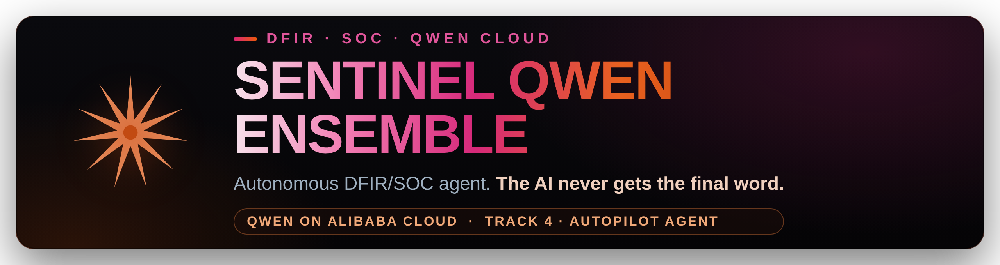
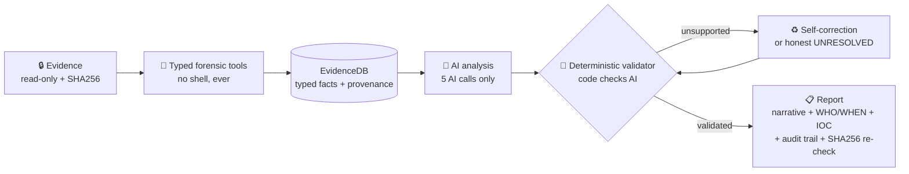
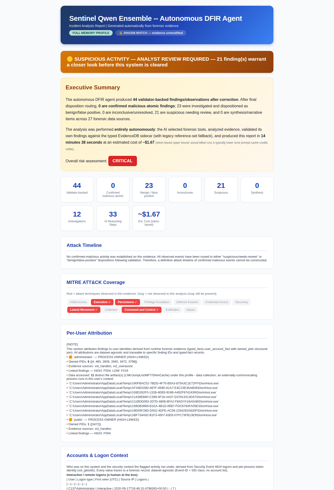

<p align="center">
  
</p>

# 🛡️ Sentinel Qwen Ensemble


-blue)


**Autonomous Digital Forensics & Incident Response / Security Operations
Center (DFIR/SOC) triage agent on Qwen Cloud (Alibaba DashScope) - Track 4
Autopilot Agent. Deterministic trust layer: code, not the LLM model, decides
what is confirmed.**

One Docker command, any OS: point it at Windows evidence (memory image, disk
image, event logs) and it investigates end-to-end -
**zero human steering, zero model shell access** - then hands you an
investigative report where **every single claim is validated against real tool
output before you ever see it**.

Incident-response agents fix outages; **Sentinel Qwen Ensemble investigates
compromises**: **195 typed forensic tools** on a custom MCP server, proven on a **PUBLIC
intrusion case you can download and rerun** (it found the whole attack and held
every lead) plus a held-back reference case (rd01, non-public) with atomic proof where it **confirms decisively** - the
trust layer is the constant, and every finding traces to the exact tool
execution that proved it.

> Global AI Hackathon with Qwen Cloud · Track 4 (Autopilot Agent) · Adil Eskintan · MIT License
> *Internal Python package name: `sift_sentinel` (stable import path; the product/repo name is Sentinel Qwen Ensemble).*

---

## Submission status (Global AI Hackathon with Qwen Cloud, Track 4)

> Honest status, not a blanket "done" - see [`QWEN-SUBMISSION.md`](QWEN-SUBMISSION.md) for the full writeup.

| Requirement | Status | Location / note |
|---|---|---|
| Open-source license (MIT) | done | [`/LICENSE`](LICENSE) - detected by GitHub, visible in About |
| Public code repository | done | [github.com/3sk1nt4n/Sentinel-Ensemble-Qwen](https://github.com/3sk1nt4n/Sentinel-Ensemble-Qwen) |
| Text description | done | [`QWEN-SUBMISSION.md`](QWEN-SUBMISSION.md) + [What it does](#-what-it-does) |
| Run instructions for judges | done | [Run it - 3 steps](#-run-it---3-steps-any-computer) + [`JUDGE-QUICKSTART.md`](JUDGE-QUICKSTART.md) |
| Proof of Deployment - code file + Base URL | done | [`src/sift_sentinel/llm_provider.py`](src/sift_sentinel/llm_provider.py) - live DashScope (Alibaba Cloud) HTTPS calls to `dashscope-intl.aliyuncs.com/compatible-mode/v1`; endpoint also recorded in [`docs/qwen-runs/`](docs/qwen-runs/) |
| Proof of Deployment - Workbench screenshot | done | [`docs/proof/`](docs/proof/) - SAS instance **Running** in Singapore (deployed per [`DEPLOY-ALIBABA.md`](DEPLOY-ALIBABA.md); live `SENTINEL-QWEN-OK` smoke call from the instance; stays running through judging) |
| Architecture diagram | done | [`ARCHITECTURE.md`](ARCHITECTURE.md) + `ARCH_VERTICAL.png` (Qwen/DashScope inference box) |
| Demonstration video (< 3 min) | done | **[youtu.be/A53FpVgdnnU](https://youtu.be/A53FpVgdnnU)** (2:50, "Sentinel Qwen Ensemble", DC01 public case) - also in-repo: [`docs/sentinel-qwen-demo.mp4`](docs/sentinel-qwen-demo.mp4). |
| Track identified | done | Track 4 - Autopilot Agent |
| Trust layer (code, not the model, decides "confirmed") | done | deterministic validator + disposition gates; every finding traces to tool output (`src/sift_sentinel/validation/`, `src/sift_sentinel/analysis/disposition.py`) |
| Self-correction | done | [`SELF-CORRECTION-PROOF.md`](SELF-CORRECTION-PROOF.md) - FP-sweep + ReAct cross-check |

**Proven on a PUBLIC case you can download and rerun** - DFIR Madness "Stolen
Szechuan Sauce" (DC01), paired memory + disk, fully autonomous on Qwen. Same
deterministic trust layer, two model tiers:

| DC01 (public, reproducible) | 🪶 Light (`qwen-plus` ×4) | ⚡ Heavy (`qwen3.7-max`) |
|---|---|---|
| Findings surfaced | 1 | **44** - the full intrusion: `coreupdater` C2 · RDP · `\FileShare\Secret` exfil · memory injection · scheduled-task / WMI persistence, attributed to `administrator` / `public`, mapped to 5 MITRE tactics |
| **Confirmed malicious** | **0** | **0** - no single artifact cleared the atomic-proof bar, so it held every lead (the trust layer working, not a gap) |
| Auto-cleared false positives | 0 | **23** |
| Tools (0 failed, both tiers) | 33 swept · 29 hit | 33 swept · 27 hit |
| Runtime · cost · integrity | 3m 46s · ~$0.22 · MATCH | 14m 39s · ~$1.67 · **SHA256 MATCH** |

**Depth scales with the tier (1 → 44 findings); the confirmation bar does not.**
DC01's intrusion is real but stealthy (a custom-named C2, living-off-the-land),
so no single artifact atomically proves malice - and the engine says exactly
that, on a case any judge can reproduce end to end.

**And when atomic proof IS present, the same engine confirms.** On a separate
held-back **reference** case (rd01, non-public), the heavy tier confirmed **4** - PsExec lateral movement,
PWDumpX credential dumping, an IFEO `sethc.exe` sticky-keys backdoor, and `p.exe`
from a temp dir - while the light tier confirmed **0**. A flags-off ablation
measured the trust layer directly: inconclusive jumped **0 → 11** without it.
**The bar does not move; the model's ability to clear it does.** Full comparison
+ shipped metrics: [`QWEN-SUBMISSION.md`](QWEN-SUBMISSION.md) · [`docs/qwen-runs/`](docs/qwen-runs/).
The trust layer, the 195 typed tools, and the 16-step conductor are
model-agnostic; only the provider/tier differs.

---

## 🚀 Run it - 3 steps, any computer

Everything runs in **Docker**, so the whole forensic toolchain (Volatility 3,
Sleuth Kit, YARA, EZ Tools, Plaso, RegRipper, bulk_extractor, …) comes bundled -
**nothing to install but Docker itself.** Follow the row for your computer.

### ⚡ Fastest: ONE command does everything

Already have Docker (step 1️⃣)? Then one paste is the whole setup - it fetches
the code (installing git if needed) and starts the **guided walkthrough**:
banner → what-to-drop-in-the-folder guide → **drag your evidence folder in** →
case card → depth pick → **hidden API-key paste** → run. Every step asks you;
nothing to memorize.

**🍎 macOS / 🐧 Linux / ☁️ cloud box** - Terminal:
```bash
curl -fsSL https://raw.githubusercontent.com/3sk1nt4n/Sentinel-Ensemble-Qwen/master/get.sh | bash
```

**🪟 Windows** - PowerShell:
```powershell
irm https://raw.githubusercontent.com/3sk1nt4n/Sentinel-Ensemble-Qwen/master/get.ps1 | iex
```

**Rest-assured mode** - one line, nothing else to know. It self-updates,
downloads the featured **memory + disk** case if needed, self-heals, builds
what's missing, then asks you the only three things that are yours to answer:
**depth (model pick: HEAVY `qwen3.7-max` / LIGHT `qwen-plus`) → hidden
API-key paste (one Enter saves it for good) → FIND**:

```bash
curl -fsSL https://raw.githubusercontent.com/3sk1nt4n/Sentinel-Ensemble-Qwen/master/get.sh | bash -s -- dc01
```

> [`get.sh`](get.sh) / [`get.ps1`](get.ps1) are short, readable scripts in this
> repo - read them first if you like. Prefer to see every step yourself? The
> classic 3-step path is right below (same result).

### 1️⃣ Install Docker Desktop (one time, ~5 min)

| Your computer | Do this once | Then use |
|---|---|---|
| 🪟 **Windows** | Install **[Docker Desktop](https://www.docker.com/products/docker-desktop/)** (keep the WSL2 backend) + **[Git](https://git-scm.com/download/win)**. Open Docker Desktop once. | **PowerShell** |
| 🍎 **macOS** | Install **[Docker Desktop](https://www.docker.com/products/docker-desktop/)** (pick **Apple-chip** or **Intel** to match your Mac). **Open Docker.app once.** Git installs in one click the first time you run it. | **Terminal** |
| 🐧 **Linux** | Nothing - if Docker is missing, `./setup.sh docker` **installs it for you**. | **Terminal** |
| ☁️ **Alibaba Cloud** (SAS/ECS Ubuntu) | Nothing - same as Linux; `./setup.sh docker` installs Docker itself. **📖 Full click-by-click walkthrough: [Run it on Alibaba Cloud](#-run-it-on-alibaba-cloud-from-a-brand-new-ubuntu-box)** (from a brand-new box). **Verified end-to-end on a SAS instance** ([`docs/proof/`](docs/proof/)); engineer runbook: [`DEPLOY-ALIBABA.md`](DEPLOY-ALIBABA.md) | **Workbench terminal** |

> ✅ You know Docker is ready when its **whale icon sits steady** (not animating).
> On a cloud box there's no icon - the launcher checks the daemon for you.

### 2️⃣ Get the code

**🪟 Windows** - open **PowerShell**, run each line by itself (it clones into
whatever folder you're currently in):
```powershell
git clone https://github.com/3sk1nt4n/Sentinel-Ensemble-Qwen.git
cd Sentinel-Ensemble-Qwen
```

**🍎 macOS / 🐧 Linux** - open the **Terminal**:
```bash
git clone https://github.com/3sk1nt4n/Sentinel-Ensemble-Qwen.git
cd Sentinel-Ensemble-Qwen
```

### 3️⃣ Run it

**🪟 Windows - PowerShell** (use **`.\setup.cmd`** - `./setup.sh` is the Mac/Linux one):
```powershell
.\setup.cmd docker                # a) free demo - no key, no evidence (~30 s + a one-time ~290 MB image build on the very first run)
.\setup.cmd C:\path\to\your\case  # b) real investigation - just the folder, ONE line
.\setup.cmd dc01                  # c) no evidence? "dc01" auto-downloads the featured case - memory + disk pair (~5.4 GB)
```

**🍎 macOS / 🐧 Linux - Terminal:**
```bash
./setup.sh docker               # a) free demo - no key, no evidence (~30 s + a one-time ~290 MB image build on the very first run)
./setup.sh /path/to/your/case   # b) real investigation - just the folder, ONE line
./setup.sh dc01                 # c) no evidence? "dc01" auto-downloads the featured case - memory + disk pair (~5.4 GB)
```

> 💡 **Easiest of all - let it ask you.** Run just **`.\setup.cmd`** (Windows) or
> **`./setup.sh`** (Mac/Linux) with nothing after it: it shows the banner,
> explains what to drop in the folder, and **asks you to paste - or drag - your
> evidence folder** into the window. No path to type.

**What command (b) does for you:** builds the toolchain image on first use (one
time, ~15 min), reads your DashScope key from `.env` / the environment (or
**asks once at a hidden prompt - one Enter saves it for good**), applies the verified-run flags, passes the `.E01`/FUSE
capabilities, mounts your evidence **read-only**, walks you through the
**case card → depth → run**, and **saves the report to `sentinel-results/<case>/`
on your machine** (open `report.md` or `summary_report_*.html`). Full guide:
[`docs/DOCKER.md`](docs/DOCKER.md). Stuck? See [Troubleshooting](#-troubleshooting).

<details>
<summary>What the one line runs under the hood (manual docker commands)</summary>

> These are plain `docker` commands - they work the same in **PowerShell** and
> the **macOS/Linux Terminal**. Only line-continuation differs: PowerShell uses a
> backtick `` ` `` where bash uses `\` (or just put the whole `docker run` on one
> line). On Windows, a case path looks like `-v C:\cases\case001:/evidence:ro`.

```bash
# zero-cost demo - no API key, no evidence, no forensic tools (~290 MB)
docker build --target demo -t sentinel-qwen:demo .
docker run --rm -it sentinel-qwen:demo

# toolchain image for real runs:
#   --target full  = memory+disk core (Vol3 + Sleuth Kit + EWF + YARA), ~485 MB
#   (default)      = full-plus: EVERYTHING the agent calls, ~1 GB
docker build -t sentinel-qwen .
# (the --cap-add/--device/--security-opt trio enables .E01 disk mounting via
#  FUSE - all three public cases below ship .E01; harmless for memory-only)
docker run --rm -it \
  --cap-add SYS_ADMIN --device /dev/fuse --security-opt apparmor:unconfined \
  --device /dev/loop-control --device-cgroup-rule='b 7:* rmw' -v /dev:/dev \
  -e SIFT_LLM_PROVIDER=qwen -e DASHSCOPE_API_KEY=sk-... \
  -e SIFT_DEFAULT_MODEL=qwen3.7-max \
  -e SIFT_HTTP_TIMEOUT=600 -e SIFT_ALLOW_YARA=1 \
  -v /path/to/your/case:/evidence:ro \
  sentinel-qwen /evidence
```

</details>

> 🔒 The image never bakes in a key (`.env` is excluded by `.dockerignore`); the
> key is passed at runtime and evidence is mounted read-only (`:ro`).

> 🧪 **Need evidence?** Free, verified public Windows cases (no login) are listed
> in **Get evidence to investigate** below.

---

## 🔑 Get a Qwen Cloud API key (the AI brain)

This project runs on **Qwen models hosted on Alibaba Cloud (DashScope / Model
Studio)**. Provider + model are chosen entirely by environment, so flipping the
whole 16-step pipeline onto Qwen needs **no code change**.

1. Go to **https://qwencloud.com** (Alibaba Cloud International) → sign up / log
   in → request the hackathon **$40 Qwen Cloud voucher** (track your credit at the **[billing console](https://billing-cost.console.alibabacloud.com/home)**, English / international). **No voucher option?** Top up a small balance instead (billing console → Top Up) - pay-as-you-go covers everything here: ~$0.22 light / ~$1.67 heavy per full investigation.
2. Create the key here: **[https://home.qwencloud.com/api-keys](https://home.qwencloud.com/api-keys)**
   → **Create API Key** → copy the `sk-…` string. (That page lives inside
   **Model Studio**, Singapore / International region.)
3. Give it to Sentinel Qwen Ensemble - **nothing to prepare, no file to edit.**
   Just launch (`.\setup.cmd` / `./setup.sh`): at the **🔑 API key** step it
   asks at a **hidden prompt** (verified live with the API before launch;
   never echoed or logged). Paste, press **Enter** - then one more **Enter**
   **saves it to the gitignored `.env`**, and **no run on that machine ever
   asks again**. (Answer `n` to keep it this-session-only instead.)

<details>
<summary>Power-user alternatives (env var · .env · API_KEY.txt - all auto-detected)</summary>

| Option | How |
|---|---|
| 🌐 **Environment variable** | `export DASHSCOPE_API_KEY=sk-…` (`QWEN_API_KEY` works too) - CI-friendly; the launchers forward it into the container. |
| 📄 **`.env` file** | `cp .env.qwen.example .env`, replace the placeholder - the same file the hidden prompt saves to. |
| 📄 **`API_KEY.txt`** | Created in the repo root on first run; replace the placeholder on the last line. Gitignored. |

</details>

> 🔓 **Order & self-healing.** The launcher picks the **first real key** it
> finds - **env var → `.env` → `API_KEY.txt`** - and a **leftover placeholder
> never beats a real key**. Nothing found? The guided flow simply asks at the
> hidden prompt. (Native runs go further: an env key the API **rejects**, e.g.
> a stale `export` / HTTP 401, automatically falls back to a valid key in your
> file before asking.)

> 💰 **Budget, not tiers.** The demo needs **no key at all**. Verified full
> investigations cost **🪶 ~$0.22 (light)** to **⚡ ~$1.67 (heavy)** - the **$40
> voucher covers ~20+ full runs** even worst-case. The 4-model ensemble makes 4
> concurrent calls; a standard pay-as-you-go DashScope key handled every verified
> run (long calls auto-retry with backoff; `SIFT_HTTP_TIMEOUT=600` is preset).
> Model tiering (flagship `qwen3.7-max` for keystone analysis, `qwen-plus` for
> high-volume stages) is in [`.env.qwen.example`](.env.qwen.example).

**Connectivity check** (optional, one cheap call - uses the demo image from
`./setup.sh docker`):

```bash
# Docker (uses the demo image from ./setup.sh docker):
docker run --rm -e SIFT_LLM_PROVIDER=qwen -e DASHSCOPE_API_KEY=sk-... \
  --entrypoint python3 sentinel-qwen:demo scripts/qwen_smoke.py

# Native (works with bare python3 - no Docker image, no install needed):
SIFT_LLM_PROVIDER=qwen DASHSCOPE_API_KEY=sk-... python3 scripts/qwen_smoke.py
```

The international (Singapore) DashScope endpoint is the default; set
`DASHSCOPE_BASE_URL` for the mainland-China endpoint.

> **Anthropic fallback (optional).** The provider seam keeps `anthropic` as the
> zero-regression fallback - unset `SIFT_LLM_PROVIDER` and set `ANTHROPIC_API_KEY`
> to run the identical pipeline on Claude. Not needed for the Qwen Cloud submission.

## ⛅ Run it on Alibaba Cloud (from a brand-new Ubuntu box)

**Never used a cloud server? No problem.** This is the complete path from an
empty Alibaba Cloud account to a finished investigation, every click and command
spelled out. It is exactly how our **Proof of Deployment** was captured.
(Engineer's condensed runbook: [`DEPLOY-ALIBABA.md`](DEPLOY-ALIBABA.md).)

> 💡 **Why a cloud box?** The hackathon's "Proof of Deployment" wants the agent's
> backend *running live on Alibaba Cloud*. A fresh Ubuntu server does exactly
> that, and it is the **same Linux path as your laptop**, just in a browser
> terminal. No SSH keys, no PuTTY, nothing to install locally.

### 1️⃣ Create the server (~5 minutes)

We use **Simple Application Server (SAS)**, the fixed-price, "up in five minutes"
option Alibaba recommends for AI-API agents.

| Do this | What to pick / know |
|---|---|
| Open the **[SAS console](https://swas.console.alibabacloud.com/)** (English / international) → **Create Server** | Sign in first; request the **$40 hackathon voucher** if you have not - **no voucher option? just top up a small balance** at the **[billing console](https://billing-cost.console.alibabacloud.com/home)** (Top Up): the plan bills monthly and a full heavy investigation costs ~$1.67 of DashScope usage |
| **Region** | **Singapore** (matches the international DashScope endpoint, lowest latency) |
| **Image** | **Ubuntu 22.04** (or 24.04), pick the plain **OS image**, not an app image |
| **Plan** | **demo + proof:** the **cheapest** tier works. **Real investigation (recommended):** the top SAS plan - **General-purpose, $48/mo: 4 vCPU / 16 GB RAM / 80 GB ESSD, 200 Mbps** - comfortably runs the featured DC01 paired case (Volatility 3 and disk extraction are CPU/RAM/disk-hungry; size RAM **above your largest memory image**). Evidence bigger than that → **ECS** (8 vCPU / 100 GB+, [`DEPLOY-ALIBABA.md`](DEPLOY-ALIBABA.md) §1B). **No GPU needed** - the AI brain runs on **Qwen Cloud**, so spend on CPU/RAM/disk instead. (Stuck on a small-RAM tier? The launcher auto-adds a swapfile so runs are not OOM-killed - they just go slower than on real RAM) |
| **Buy**, then wait ~60 seconds | the server gets a **public IP** automatically |

> ✅ **You did it when:** the server card shows **Running** with a green dot.

### 2️⃣ Open the terminal (browser, no SSH)

1. On the server card, click **Reset Password** once (SAS ships with no password).
2. Click **Connect → Workbench**. A **browser terminal** opens, logged in as
   `root`. *(This is the exact console view our proof screenshot comes from.)*

<details>
<summary>⚡ <b>In a hurry? ONE paste does the whole thing</b> (steps 3️⃣-4️⃣ explain it)</summary>

```bash
# Everything: installs git+Docker, fetches the code, downloads the featured
# memory + disk case, builds the toolchain, then asks depth -> hidden key -> FIND
curl -fsSL https://raw.githubusercontent.com/3sk1nt4n/Sentinel-Ensemble-Qwen/master/get.sh | bash -s -- dc01
```

(Want the free no-key demo first? Same line with `docker` instead of `dc01`.)

</details>

### 3️⃣ Install + build (ONE paste, ~15 min the first time)

Paste this single line into the Workbench terminal:

```bash
curl -fsSL https://raw.githubusercontent.com/3sk1nt4n/Sentinel-Ensemble-Qwen/master/get.sh | bash -s -- docker
```

That one line does it all: **installs git and Docker** (if missing), **fetches
the code**, builds the image with the *entire* forensic toolchain baked in
(Volatility 3, Sleuth Kit, EZ Tools, Plaso, YARA, …), and runs a **free,
no-key demo** to prove the flow.

<details>
<summary>Prefer the classic paste (no piped script)?</summary>

```bash
sudo apt-get update && sudo apt-get install -y git
git clone https://github.com/3sk1nt4n/Sentinel-Ensemble-Qwen.git
cd Sentinel-Ensemble-Qwen
./setup.sh docker
```

</details>

> ✅ **You did it when:** the demo ends with the **CASE 1 card** and
> **`Everything verified and ready`**, then setup.sh prints **`✅  Docker demo
> works.`** (The `PIPELINE SUMMARY` box comes later, on a real evidence run -
> step 6️⃣.) The first build takes ~15 min (it downloads the toolchain once);
> every run after that is instant.

### 4️⃣ Run a real investigation (ONE command - it asks for everything else)

No key setup, no downloads, no `.env` editing - the magic case name **`dc01`**
tells the launcher to **fetch the featured public case itself** (the **DFIR
Madness "Stolen Szechuan Sauce" DC01** **memory + disk pair**, the exact
investigation shown in the demo video; ~5.4 GB, one time, downloads resume if
interrupted):

```bash
cd ~/Sentinel-Ensemble-Qwen && ./setup.sh dc01
```

(No `sudo` needed - the script escalates by itself exactly where required.)

<details>
<summary>Prefer to download the evidence yourself (or use another case)?</summary>

```bash
sudo apt-get install -y unzip && mkdir -p ~/cases/dc01 && cd ~/cases/dc01 && wget https://dfirmadness.com/case001/DC01-memory.zip https://dfirmadness.com/case001/DC01-E01.zip && unzip -o DC01-memory.zip && unzip -o DC01-E01.zip && cd ~/Sentinel-Ensemble-Qwen && ./setup.sh ~/cases/dc01
```

One paste-safe line on purpose: pasting a multi-line block into a busy
terminal can feed later lines into a still-running command. More cases:
[🧪 Get evidence](#-get-evidence-to-investigate).

</details>

**The walkthrough asks you three things, in order:** the case card
auto-detects the **paired memory + disk** shape (the strongest evidence
combo); the depth prompt asks **HEAVY** (`qwen3.7-max`, ≈ $1.67 - the featured
verified configuration) or **LIGHT** (`qwen-plus`, ≈ $0.22 - the budget pass);
the **🔑 hidden prompt** asks for your key **once** - paste, **Enter**, and
one more **Enter saves it to the gitignored `.env`** so it is never asked
again ([get a key](#-get-a-qwen-cloud-api-key-the-ai-brain)). Type **FIND**
and the 16-step pipeline streams live. Evidence is mounted **read-only** and
**SHA256-fingerprinted before and after** (chain of custody).

> ✅ **You did it when:** the run ends with **`SHA256 MATCH`** and the report +
> dashboard are on the box in `~/Sentinel-Ensemble-Qwen/sentinel-results/dc01/`
> (`report.md`, `summary_report_*.html`) - the same DC01 intrusion chain the
> verified Qwen runs in [`docs/qwen-runs/`](docs/qwen-runs/) found. That is the
> full replication of our featured run, on your own Alibaba Cloud box.

### 5️⃣ (Optional) Prove the Qwen connection in 10 seconds

Once the key is saved (one Enter at the hidden prompt above), the smoke test
reads it straight from `.env`:

```bash
cd ~/Sentinel-Ensemble-Qwen && sudo docker run --rm -e SIFT_LLM_PROVIDER=qwen --env-file .env \
  --entrypoint python3 sentinel-qwen:demo scripts/qwen_smoke.py
```

> ✅ **You did it when:** it prints **`SENTINEL-QWEN-OK`**, a live Qwen call to
> `dashscope-intl.aliyuncs.com`, made **from your Alibaba Cloud box**.

### 6️⃣ Capture the Proof of Deployment (for judges)

With the instance showing **Running** in the console, screenshot the **Servers /
Workbench view** (compute in the Running state, this backend deployed on it).
That screenshot **plus** the Base URL in
[`llm_provider.py`](src/sift_sentinel/llm_provider.py) is the complete Proof of
Deployment. Full details: [`DEPLOY-ALIBABA.md`](DEPLOY-ALIBABA.md) §6.

---

**✅ Cloud checkpoint, you are done when each of these is true:**

| Step | Success signal |
|---|---|
| Server up | Console shows **Running** (green dot) |
| Toolchain built | Demo ends `Everything verified and ready` + `✅  Docker demo works.` |
| Investigation | A report appears in `sentinel-results/dc01/` with **SHA256 MATCH** |
| Qwen wired (optional double-check) | Smoke test prints **`SENTINEL-QWEN-OK`** |

## 🧪 Get evidence to investigate

Any of these work - the pipeline auto-detects what you give it (memory-only,
disk-only, or both together). The public practice cases below are free,
direct downloads - no login (links verified 2026-07-05):

| Source | What you get | Size |
|---|---|---|
| **DFIR Madness "The Stolen Szechuan Sauce"** - [DC01 memory](https://dfirmadness.com/case001/DC01-memory.zip) + [DC01 disk](https://dfirmadness.com/case001/DC01-E01.zip) | **paired memory + disk** (Windows Server 2012 R2 DC) - the strongest shape; unzip both into one folder | 0.6 + 4.8 GB |
| **NIST CFReDS "Data Leakage Case"** - [PC disk image](https://cfreds-archive.nist.gov/data_leakage_case/images/pc/cfreds_2015_data_leakage_pc.E01) | disk-only (Windows 7 `.E01`) - the smallest real case | 2.1 GB |
| **Digital Corpora "Lone Wolf" (2018)** - [image files](https://downloads.digitalcorpora.org/corpora/scenarios/2018-lonewolf/) | paired (Windows 10): split `LoneWolf.E01`-`.E09` + `memdump.mem` | ~14 + 18 GB |
| **Your own captures** | `.E01`/`.raw` disk images, `.raw`/`.vmem`/`.img`/`.mem` memory, exported `.evtx` logs | - |

Put everything for one case in **one folder** (example: `/cases/evidence/`).
A typical strong pair: one memory image + one disk image from the same machine.
(The practice cases are third-party training material by their respective
authors; the pipeline is dataset-agnostic, so any Windows evidence works.)

> 🔒 Evidence is mounted **strictly read-only** and SHA256-fingerprinted before
> and after the run (chain of custody by math, not promises).

## 🎬 What you'll see when it runs

After you launch **command (b)** above, it walks you through everything - one
line in, a finished report out:

1. A **fancy banner**, then it **probes your evidence** (memory vs disk, by
   content not filename) and mounts the disk **read-only**.
2. A **case card** - what it found, the OS, health, sizes, SHA256. Just read it.
3. The **analysis depth** menu - press `1` (or Enter) for ⚡ **HEAVY**
   (`qwen3.7-max`, deepest) or `2` for 🪶 **LIGHT** (`qwen-plus`, cheaper).
   **Choosing the depth launches the run.**
4. The **🔑 API key** step - if it's in `.env` / your environment it's used
   automatically; otherwise you're asked **once, at a hidden prompt** (never
   echoed, logged, saved, or baked into the image).
5. Then **touch nothing** - minutes, not hours.
6. Your **report lands on your machine** in `sentinel-results/<case>/`
   (`report.md` + the interactive `summary_report_*.html`). Every finding links
   to the exact tool execution that proved it.

Inside the container the launcher is `findevil.sh` (the image's entrypoint);
contributors hacking on the code natively: see [`ONBOARDING.md`](ONBOARDING.md).

---

## 🔍 What it does

Sentinel Qwen Ensemble investigates Windows evidence (memory images, disk images,
event logs) end-to-end with **zero human steering and zero model shell access**:

- A deterministic 16-step conductor (`run_pipeline.py`) drives everything; the
  AI is invoked exactly **5 times** (tool selection, analysis, investigation
  threads, the Step-13AA self-correction finalize, and the report).
- **Architectural pattern: Custom MCP Server** - every forensic tool is a
  **typed MCP function** - the model never constructs
  command syntax and never touches bash.
- Every AI claim is checked against a **paired reference set** built from real
  tool output during the run; unsupported claims are **blocked**, then
  self-corrected or honestly reported as **UNRESOLVED** (honest failure beats
  a wrong answer).
- A **4-model ensemble + deterministic cross-checks** disposition findings into
  confirmed / needs-review / benign / false-positive, with confidence earned by
  **independent artifact types** (memory + disk + logs) - not model feeling.
- An **opt-in analyst checkpoint** (`SIFT_HITL_CHECKPOINT=1`) pauses at the
  disposition decision, *before* the report, so a human can approve or override
  any verdict - the Track-4 human-in-the-loop gate (the agent automates the
  judgement; the human authorises the action).
- A **report-integrity layer** keeps the story honest end-to-end: the
  executive summary can never name a finding "confirmed" that the evidence
  pipeline didn't confirm (any mismatch is auto-annotated with the finding's
  true status), benign rows always explain *why* they were cleared, and
  duplicate findings about the same artifact (same file, same registry key,
  same Windows service) are merged before you read them.
- Output: a structured investigative narrative with **WHO/WHEN context**, a
  **network IOC roll-up**, and a finding-by-finding **audit trail** to tool
  executions.



## 🪜 The five stages

1. **Step-0 onboarding** - finds and profiles the evidence, mounts read-only,
   SHA256-fingerprints it (chain of custody).
2. **Tool sweep + EvidenceDB** - runs the forensic tools via typed functions,
   parses every output into typed facts with provenance.
3. **AI analysis** - the model selects tools and writes candidate findings
   from parsed facts **only**.
4. **Validation + cross-check** - deterministic validator, ReAct investigation
   threads, self-correction, disposition. **Code checks AI; AI never grades itself.**
5. **Reporting** - investigative narrative + audit log; SHA256 verified again
   (spoliation check).

## 📄 What you get after a run

| Artifact | What it is |
|---|---|
| `report.md` | the investigative narrative - findings first, plain-English "why it matters" per finding, each rendered as its own detail section |
| `run_summary.md` | tools · dispositions · cost · tokens at a glance |
| `agent_execution_log.txt` | append-only execution log - every tool call, timestamps, token usage |
| `finding_disposition_buckets.json` | confirmed / needs-review / benign / false-positive buckets, each with its reasoning - written to the run directory; `report.md` renders from it |
| `summary_report_*.html` | the interactive one-page dashboard - **opens automatically in your browser** the moment the run finishes (disable with `SIFT_NO_OPEN=1`) |
| `incident_report_*.md` | the full forensic report (timestamped copy saved alongside) |

### 👀 See a real report right now (no install, one click)

This is the actual HTML dashboard from the featured **public DC01** run:

**▶ [View the live interactive report](https://htmlpreview.github.io/?https://github.com/3sk1nt4n/Sentinel-Ensemble-Qwen/blob/master/docs/example-report-dc01-heavy.html)** - renders in your browser, nothing to download.

<p align="center">
  
</p>

> GitHub shows a committed `.html` as raw source, so the link above uses
> `htmlpreview` to render it live. The full file is
> [`docs/example-report-dc01-heavy.html`](docs/example-report-dc01-heavy.html).

## 🧯 Troubleshooting

| Symptom | Fix |
|---|---|
| `.\setup.cmd` / `./setup.sh` "not recognized" or nothing happens | wrong terminal: **Windows** uses **`.\setup.cmd`** in **PowerShell**; **macOS/Linux** uses `./setup.sh` in the **Terminal**. Run each line separately (older PowerShell rejects `&&`) |
| PowerShell "running scripts is disabled" | use **`.\setup.cmd`** (needs no policy change). Only if you chose `.\setup.ps1` directly, one-time: `Set-ExecutionPolicy -Scope CurrentUser -ExecutionPolicy RemoteSigned`, answer `Y`, re-run |
| No Docker / daemon not running | install/start **Docker Desktop** (docker.com); on **Linux** `./setup.sh docker` even offers to install Docker for you and falls back to `sudo docker` automatically |
| `docker: --env-file: invalid env file (.env)` | your `.env` was hand-edited into an invalid state (e.g. stray characters before a `#`). Fix: `rm .env`, then run `./setup.sh dc01` (or your case) - the hidden key prompt recreates it cleanly |
| Ran `sudo ./setup.sh dc01` earlier and it re-downloaded the samples | older versions looked in root's home under `sudo`. Fixed: the script now resolves the real user's home either way, and the next run automatically rescues anything a sudo run left under `/root/cases/dc01` - nothing to clean up by hand |
| `run_pipeline.py exited with code -9` | the kernel's OOM killer ran out of RAM mid-run (confirm: `sudo dmesg -T \| grep -i oom`). The launcher now auto-adds an 8 GB swapfile on small-RAM boxes; re-run the same command. For real investigations prefer a 16 GB RAM plan |
| `.E01` disk won't mount in the container | launch via `.\setup.cmd C:\path\to\case` / `./setup.sh /path/to/case` - it passes the required FUSE flags automatically (manual flags: [`docs/DOCKER.md`](docs/DOCKER.md) §3) |
| The run doesn't start after you pick depth | you ran `step0_onboard.py` directly (staged / dev mode) - use `.\setup.cmd` / `./setup.sh` / `findevil.sh`, which are live by default |
| No prompt appears in CI/scripts | that's by design: headless + no path → usage + exit 2 (no hang) |

## 🌍 Dataset-agnostic by construction

No case-specific indicators (hostnames, usernames, IPs, tool-name lists, PIDs,
hashes) are embedded in code, prompts, or fixtures - detection is **behavioral
and structural only** (process ancestry, RWX anomalies, Event-ID grammar,
egress outliers). Guard tests enforce it, a commit-time audit
(`audit/nocheat.py`) bans answer-key vocabulary, and the release pipeline
hard-fails if a case token would ever ship.

Two examples of the principle in practice:

- **Domains by standard, not by list** - a token counts as a domain only if
  its final label is a registered IANA TLD (vendored from the Public Suffix
  List, identical for every case on earth); ambiguous TLD/file-extension
  collisions additionally require the run to have seen the token as a URL
  host. No domain or extension blocklist decides anything.
- **IOCs by correlation, not by lookup** - a network indicator is reported as
  malicious only because a validator-backed finding in *this run* proved it
  (verdict inherited from the finding's disposition, related finding IDs
  cited). The confirmed tier doubles as a copy-pasteable block/hunt list.

### 🎛️ Deepest-accuracy run (optional flags)

Defaults are tuned for zero-regression. For the strongest adjudication layer:

```bash
SIFT_INV3A_ENRICH=1 SIFT_MODEL_INV3A=qwen3.7-max \
SIFT_INV3A_JIT_RWX_GUARD=1 SIFT_USER_8DOT3_CANON=1 ./setup.sh /path/to/case
```

(`./setup.sh` forwards every `SIFT_*` variable you set into the container;
`./setup.sh run /path/to/case` remains an accepted alias.)

`SIFT_INV3A_ENRICH` gives the final false-positive sweep a deterministic
cross-reference per finding; `SIFT_MODEL_INV3A` routes that single call to a
stronger model; the guard suppresses classic JIT/.NET RWX false-positive
promotions structurally (no process-name allowlist); the 8.3 flag folds
short-name user identities into their long form. Every flag has a kill-switch
and fails closed.

---

See [`ARCHITECTURE.md`](ARCHITECTURE.md) and [`docs/`](docs/) for the full
design · [`JUDGE-QUICKSTART.md`](JUDGE-QUICKSTART.md) for the judge path ·
[`EXTENDING.md`](EXTENDING.md) to add your own forensic tool ·
MIT © Adil Eskintan
