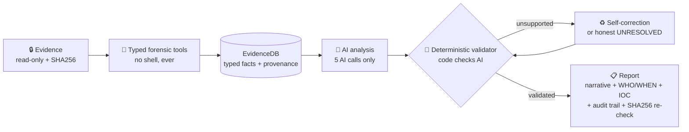

# 🛡️ Sentinel Ensemble


**Autonomous agentic DFIR for the SANS SIFT Workstation.** Point it at Windows
evidence (memory image, disk image, event logs) and it investigates end-to-end -
**zero human steering, zero model shell access** - then hands you an
investigative report where **every single claim is validated against real tool
output before you ever see it**.

> Find Evil! AI Hackathon 2026 · Adil Eskintan · MIT License
> *Internal Python package name: `sift_sentinel` (stable import path; the product/repo name is Sentinel Ensemble).*

---

## ✅ Submission Compliance Checklist

| Requirement | Status | Location |
|---|---|---|
| Open-source license (MIT) | ✓ | [`/LICENSE`](LICENSE) - detected by GitHub, visible in About |
| README with setup instructions | ✓ | this file - [Start from zero](#-start-from-zero-never-used-sift-before) + [Install](#-install) |
| Run instructions for judges | ✓ | [Quick Start](#-quick-start) + [`JUDGE-QUICKSTART.md`](JUDGE-QUICKSTART.md) |
| Text description | ✓ | [What it does](#-what-it-does) |
| Demonstration video | ✓ | **▶ [YouTube demo](https://www.youtube.com/watch?v=Vqbt3Z4k6n0)** |
| Architecture diagram | ✓ | [`ARCHITECTURE.md`](ARCHITECTURE.md) (16-step + MCP diagrams; PNG at submission) |
| Evidence Dataset Documentation | ✓ | [`docs/DATASET.md`](docs/DATASET.md) |
| Accuracy Report | ✓ | [`docs/ACCURACY.md`](docs/ACCURACY.md) |
| Agent Execution Logs | ✓ | [`artifacts/run-rd01/`](artifacts/run-rd01/) (report + full step-by-step execution log + interactive HTML + summary) |
| Self-correction demonstrated | ✓ | **[`SELF-CORRECTION-PROOF.md`](SELF-CORRECTION-PROOF.md)** - every correction listed, before→after, with log line refs · FP-sweep + ReAct cross-check |
| Accuracy validation demonstrated | ✓ | deterministic validator - every finding traces to tool output (`src/sift_sentinel/validation/`) |
| Analytical reasoning demonstrated | ✓ | structured investigative narrative report (not a raw log) |

*All hackathon submission requirements are met.*

---

## 🧭 Start from zero (never used SIFT before?)

Four things, in order. If you already have SIFT + an API key, jump to [Install](#-install).

### 1️⃣ Get the SANS SIFT Workstation (the free forensic VM)

SIFT is the platform this tool runs on - it ships Volatility 3, Sleuth Kit,
EWF tools, and Plaso pre-installed, so you install almost nothing.

1. Go to the official SANS SIFT page:
   **https://sans.org/tools/sift-workstation** - download the **pre-built VM
   appliance (`.ova`)** and run it in a VM (easiest), or run the installer on a
   clean Ubuntu 22.04 system.
2. If you took the VM appliance: import it into **VMware Workstation Player**
   (free) or **VirtualBox** (free) - *File → Open/Import Appliance → select the
   downloaded file → Import*. Give it ≥ 8 GB RAM and ≥ 80 GB disk if asked.
3. Start the VM and log in - default SIFT credentials are user
   **`sansforensics`**, password **`forensics`**.
4. Open a terminal (you'll live here from now on).

### 2️⃣ Get an Anthropic API key (the AI brain)

1. Go to **https://console.anthropic.com** → sign up / log in.
2. **API keys → Create key** → copy the `sk-ant-…` string.
3. Give it to Sentinel Ensemble in **any one of three ways** - pick whatever's
   easiest (you genuinely cannot get stuck: a real key always wins, and a bad one
   falls through to the next option):

| | Option | How | Notes |
|---|---|---|---|
| **①** | **🚀 Just run it & paste** *(recommended)* | Run the launcher - at the `🔑 API key` step it asks you at a **hidden prompt**. Paste, press Enter. | Verified live · this session only · **never echoed, logged, or written to disk**. Nothing to find or edit. |
| **②** | **📄 A visible file** *(set once)* | Open **`API_KEY.txt`** in the repo root, replace the placeholder on the **last line** with your key, **save**. | Created for you on first run · **gitignored**, so your key is never committed · no prompt next time. |
| **③** | **🌐 Environment variable** | `export ANTHROPIC_API_KEY=sk-ant-…` (a hidden `.env` with `ANTHROPIC_API_KEY=…` works too). | For CI / power users. |

   > **🔓 Order & self-healing.** The launcher checks **env var → `.env` →
   > `API_KEY.txt`**. A real key always beats a leftover placeholder, and if the
   > environment key is rejected - e.g. a stale `export` left in your shell - it
   > **automatically falls back** to a valid key in your file *before* asking, so
   > the file you just edited always works.

> ⚠️ **API tier matters.** The analysis stage runs a **4-model ensemble in
> parallel** (4 concurrent API calls), so a **Tier-1** account ($5) is likely
> to hit rate limits (HTTP 429) on a live run. Use **at least Tier-2** ($40) -
> **Tier-3** ($200) for the smoothest run. Your tier auto-increases with account
> age + spend; check / raise it at **https://platform.claude.com/settings/limits**. The
> `--demo` mode needs **no key and no tier** (a typical full investigation costs
> a few dollars; pick depth **2 / Haiku** for the cheapest live run).

### 3️⃣ Get evidence to investigate

Any of these work - the pipeline auto-detects what you give it (memory-only,
disk-only, or both together):

| Source | What you get |
|---|---|
| **Official hackathon starter case data** - **[download](https://sansorg.egnyte.com/fl/HhH7crTYT4JK)** (also posted on the Protocol SIFT Slack, per the official rules) | ready-made disk + memory case data |
| **Your own captures** | `.E01`/`.raw` disk images, `.raw`/`.vmem`/`.img` memory, exported `.evtx` logs |

Put everything for one case in **one folder** (example: `/cases/evidence/`).
A typical strong pair: one memory image + one disk image from the same machine.

> 🔒 Evidence is mounted **strictly read-only** and SHA256-fingerprinted before
> and after the run (chain of custody by math, not promises).

### 4️⃣ Install & run - see the next two sections. That's it.

---

## 📦 Install

```bash
git clone https://github.com/3sk1nt4n/Sentinel-Ensemble.git
cd Sentinel-Ensemble
pip install -r requirements.txt
./findevil.sh --demo                     # smoke test - no evidence, no API key needed
```

> On newer Ubuntu (PEP 668 "externally managed environment") plain `pip install`
> is refused - use a venv (`python3 -m venv .venv && . .venv/bin/activate`)
> or add `--break-system-packages`. The SIFT Ubuntu 22.04 VM accepts the
> plain command.

If `./findevil.sh --demo` prints a synthetic case card ending in
**"Everything verified and ready."** - your install works. 🎉

## 🚀 Quick Start

```bash
./findevil.sh                      # asks ONE question: where is the evidence
./findevil.sh /cases/evidence      # or pass the path directly
./findevil.sh --demo               # synthetic walkthrough - no evidence, no API key
./findevil.sh --dry-run /cases/evidence   # full onboarding + printed plan, pipeline NOT executed
```

A real run, start to finish - one command, two prompts:

1. Type `./findevil.sh`
2. It asks **where the evidence is** - type your case folder path
   (example: `/cases/evidence/my-case` - the folder holding your memory/disk images).
3. It scans the evidence and shows a **case card** (what it found, sizes, SHA256). Just read it.
4. It asks the **analysis depth** - `1` (or Enter) = ⚡ HEAVY (Claude Opus 4.8, ~$8-15/case)
   or `2` = 🪶 LIGHT (Claude Haiku 4.5, ~$2-3/case). **Choosing the depth launches the run.**
5. The **API key** step - if you set it already (visible `API_KEY.txt`, `.env`, or
   `ANTHROPIC_API_KEY`) it's used automatically; otherwise paste it at the hidden
   prompt (blank screen while pasting is normal; never echoed, logged, or saved).
6. Wait minutes, not hours. Touch nothing.
7. Read the report - every finding links to the exact tool execution that proved it.

`findevil.sh` checks dependencies, then delegates to the conversational
onboarding (`python3 step0_onboard.py` - same flags, same behavior).

---

## 🔍 What it does

Sentinel Ensemble investigates Windows evidence (memory images, disk images,
event logs) end-to-end with **zero human steering and zero model shell access**:

- A deterministic 16-step conductor (`run_pipeline.py`) drives everything; the
  AI is invoked exactly **5 times** (tool selection, analysis, investigation
  threads, the Step-13AA self-correction finalize, and the report).
- **Architectural pattern: Custom MCP Server** - every forensic tool is a
  **typed MCP function** - the model never constructs
  command syntax and never touches bash.
- Every AI claim is checked against a **paired reference set** built from real
  tool output during the run; unsupported claims are **blocked**, then
  self-corrected or honestly reported as **UNRESOLVED** (honest failure beats
  a wrong answer).
- A **4-model ensemble + deterministic cross-checks** disposition findings into
  confirmed / needs-review / benign / false-positive, with confidence earned by
  **independent artifact types** (memory + disk + logs) - not model feeling.
- A **report-integrity layer** keeps the story honest end-to-end: the
  executive summary can never name a finding "confirmed" that the evidence
  pipeline didn't confirm (any mismatch is auto-annotated with the finding's
  true status), benign rows always explain *why* they were cleared, and
  duplicate findings about the same artifact (same file, same registry key,
  same Windows service) are merged before you read them.
- Output: a structured investigative narrative with **WHO/WHEN context**, a
  **network IOC roll-up**, and a finding-by-finding **audit trail** to tool
  executions.



## 🪜 The five stages

1. **Step-0 onboarding** - finds and profiles the evidence, mounts read-only,
   SHA256-fingerprints it (chain of custody).
2. **Tool sweep + EvidenceDB** - runs the forensic tools via typed functions,
   parses every output into typed facts with provenance.
3. **AI analysis** - the model selects tools and writes candidate findings
   from parsed facts **only**.
4. **Validation + cross-check** - deterministic validator, ReAct investigation
   threads, self-correction, disposition. **Code checks AI; AI never grades itself.**
5. **Reporting** - investigative narrative + audit log; SHA256 verified again
   (spoliation check).

## 📄 What you get after a run

| Artifact | What it is |
|---|---|
| `report.md` | the investigative narrative - findings first, plain-English "why it matters" per finding (the per-finding customer table renders into its sections) |
| `run_summary.md` | tools · dispositions · cost · tokens at a glance |
| `agent_execution_log.txt` | append-only execution log - every tool call, timestamps, token usage |
| `finding_disposition_buckets.json` | confirmed / needs-review / benign / false-positive buckets, each with its reasoning - written to the run directory; `report.md` renders from it |

## 🧯 Troubleshooting

| Symptom | Fix |
|---|---|
| `pip install` refused (PEP 668) | `python3 -m venv .venv && . .venv/bin/activate && pip install -r requirements.txt` |
| `ERROR: Missing dependencies` from findevil.sh | run the pip install line above, then retry |
| The run doesn't start after you pick depth | you ran `step0_onboard.py` directly (staged / dev mode) - use `./findevil.sh`, which is live by default |
| No prompt appears in CI/scripts | that's by design: headless + no path → usage + exit 2 (no hang) |

## 🌍 Dataset-agnostic by construction

No case-specific indicators (hostnames, usernames, IPs, tool-name lists, PIDs,
hashes) are embedded in code, prompts, or fixtures - detection is **behavioral
and structural only** (process ancestry, RWX anomalies, Event-ID grammar,
egress outliers). Guard tests enforce it, a commit-time audit
(`audit/nocheat.py`) bans answer-key vocabulary, and the release pipeline
hard-fails if a case token would ever ship.

Two examples of the principle in practice:

- **Domains by standard, not by list** - a token counts as a domain only if
  its final label is a registered IANA TLD (vendored from the Public Suffix
  List, identical for every case on earth); ambiguous TLD/file-extension
  collisions additionally require the run to have seen the token as a URL
  host. No domain or extension blocklist decides anything.
- **IOCs by correlation, not by lookup** - a network indicator is reported as
  malicious only because a validator-backed finding in *this run* proved it
  (verdict inherited from the finding's disposition, related finding IDs
  cited). The confirmed tier doubles as a copy-pasteable block/hunt list.

### 🎛️ Deepest-accuracy run (optional flags)

Defaults are tuned for zero-regression. For the strongest adjudication layer:

```bash
SIFT_INV3A_ENRICH=1 SIFT_MODEL_INV3A=claude-opus-4-8 \
SIFT_INV3A_JIT_RWX_GUARD=1 SIFT_USER_8DOT3_CANON=1 python3 findevil.py
```

`SIFT_INV3A_ENRICH` gives the final false-positive sweep a deterministic
cross-reference per finding; `SIFT_MODEL_INV3A` routes that single call to a
stronger model; the guard suppresses classic JIT/.NET RWX false-positive
promotions structurally (no process-name allowlist); the 8.3 flag folds
short-name user identities into their long form. Every flag has a kill-switch
and fails closed.

---

See [`ARCHITECTURE.md`](ARCHITECTURE.md) and [`docs/`](docs/) for the full
design · [`JUDGE-QUICKSTART.md`](JUDGE-QUICKSTART.md) for the judge path ·
[`EXTENDING.md`](EXTENDING.md) to add your own forensic tool ·
MIT © Adil Eskintan
