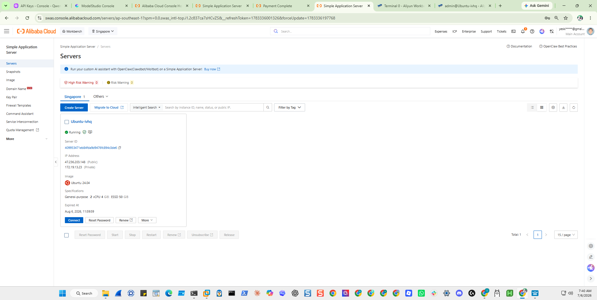

# Proof of Deployment on Alibaba Cloud - screenshot

Devpost x Qwen Cloud requires **visual evidence** that the project ran on Alibaba
Cloud, in addition to the code-file proof ("No proof = not eligible", per the
official 2026-06-30 update). Drop the screenshot here as
**`alibaba-workbench.png`** and it will render below.

**What the official guide's sample screenshots show** (and therefore the safe
target): a **compute instance in the *Running* state**, in the Alibaba Cloud
console **Workbench Overview** - either:

- **ECS** > My Resources: your instance listed as **Running**, or
- **Simple Application Server (SAS)**: the server card in **Running** state.
  The guide itself recommends SAS for "LLM API wrapper agents" and says it
  deploys "in under 5 minutes" - the fastest route.

A Model Studio / DashScope usage screenshot does **not** match either official
sample - treat it as supplementary only, not the proof.

The official Build Session FAQ states the bar exactly: *"a valid environment
screenshot from your active platform console showing that your operational
application backend is running live inside an Alibaba Cloud ECS or SAS container
setup."* So: deploy this repo on the instance per
[`../../DEPLOY-ALIBABA.md`](../../DEPLOY-ALIBABA.md), run the agent there (at
minimum `./findevil.sh --demo` plus one live `scripts/qwen_smoke.py` call, or a
full light run), then capture the Workbench Overview showing the instance
**Running**. A 10-second screen recording of the same view cheaply covers the
older "short recording" wording still on the hackathon main page.

Then attach the same image to the Devpost "Proof of Deployment" submission
question - and **keep the instance running through the judging period (Jul
10-31)**: the FAQ says an Alibaba-hosted backend "enables live verification and
direct execution testing during the validation period" and counts as an
evaluation plus-point.

<!-- Once added:

-->

> Companion evidence already in the repo: the code file
> [`../../src/sift_sentinel/llm_provider.py`](../../src/sift_sentinel/llm_provider.py)
> (hardcodes the listed Base URL `https://dashscope-intl.aliyuncs.com/compatible-mode/v1`)
> and the run metrics in [`../qwen-runs/`](../qwen-runs/)
> (each records `llm_endpoint` = that DashScope endpoint).
